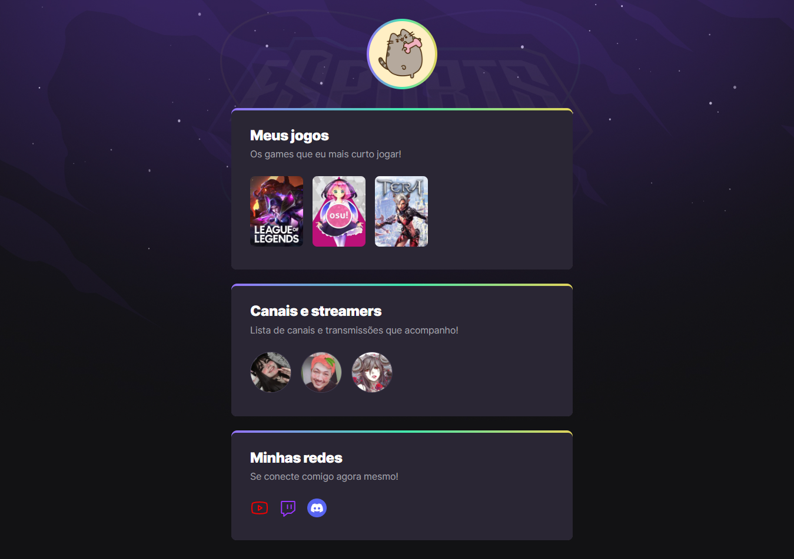

# NLW eSports

> Trilha Explorer 

Projeto que desenvolvi durante o evento Next Level Week da Rocketseat 🚀

[Clique aqui para acessar o projeto](https://gabrielmisato.github.io/nlw-esports-explorer/)

## 🎮 Como foi participar do evento
Este foi o meu primeiro projeto desenvolvido em um evento do NLW da Rocketseat. Como sou uma pessoa que adora jogar, este projeto acabou atraindo minha atenção e não me arrependo de ter participado deste evento incrível.

## 🔨Tecnologias Utilizadas
- HTML
- CSS
- Git e Github
